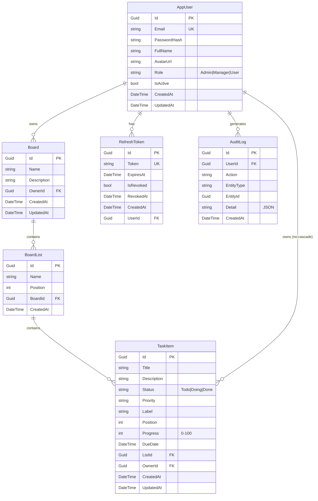

# 🗄️ TaskHub Database Schema (ERD)

## Stack: SQL Server + Entity Framework Core (Code First)

---

# 1. ERD — Entity Relationship Diagram



---

# 2. Tables Chi tiết

## 2.1 AppUser (Users)

| Column       | Type         | Constraints              |
| ------------ | ------------ | ------------------------ |
| Id           | Guid         | PK, auto-generated       |
| Email        | string       | UNIQUE, NOT NULL          |
| PasswordHash | string       | NOT NULL (BCrypt)         |
| FullName     | string       | NOT NULL                  |
| AvatarUrl    | string?      | nullable                  |
| Role         | string       | Enum → string conversion  |
| IsActive     | bool         | default: true             |
| CreatedAt    | DateTime     | default: UTC now          |
| UpdatedAt    | DateTime?    | nullable                  |

**Enum UserRole:**
```csharp
public enum UserRole { Admin, Manager, User }
```

---

## 2.2 Board (Boards)

| Column      | Type      | Constraints         |
| ----------- | --------- | ------------------- |
| Id          | Guid      | PK                  |
| Name        | string    | NOT NULL             |
| Description | string?   | nullable             |
| OwnerId     | Guid      | FK → AppUser.Id      |
| CreatedAt   | DateTime  | default: UTC now     |
| UpdatedAt   | DateTime? | nullable             |

**Relationships:**
- AppUser → Board: One-to-Many (Cascade Delete)

---

## 2.3 BoardList (Lists)

| Column    | Type     | Constraints        |
| --------- | -------- | ------------------ |
| Id        | Guid     | PK                 |
| Name      | string   | NOT NULL            |
| Position  | int      | ordering            |
| BoardId   | Guid     | FK → Board.Id       |
| CreatedAt | DateTime | default: UTC now    |

**Relationships:**
- Board → BoardList: One-to-Many (Cascade Delete)

---

## 2.4 TaskItem (Tasks)

| Column      | Type      | Constraints           |
| ----------- | --------- | --------------------- |
| Id          | Guid      | PK                    |
| Title       | string    | NOT NULL               |
| Description | string?   | nullable               |
| Status      | string    | default: "Todo"        |
| Priority    | string?   | nullable               |
| Label       | string?   | nullable               |
| Position    | int       | ordering               |
| Progress    | int       | 0-100                  |
| DueDate     | DateTime? | nullable               |
| ListId      | Guid      | FK → BoardList.Id      |
| OwnerId     | Guid      | FK → AppUser.Id        |
| CreatedAt   | DateTime  | default: UTC now       |
| UpdatedAt   | DateTime? | nullable               |

**Relationships:**
- BoardList → TaskItem: One-to-Many (Cascade Delete)
- AppUser → TaskItem: One-to-Many (**NoAction** — tránh multiple cascade)

---

## 2.5 RefreshToken

| Column    | Type      | Constraints        |
| --------- | --------- | ------------------ |
| Id        | Guid      | PK                 |
| Token     | string    | UNIQUE, NOT NULL    |
| ExpiresAt | DateTime  | NOT NULL            |
| IsRevoked | bool      | default: false      |
| RevokedAt | DateTime? | nullable            |
| CreatedAt | DateTime  | default: UTC now    |
| UserId    | Guid      | FK → AppUser.Id     |

**Relationships:**
- AppUser → RefreshToken: One-to-Many (Cascade Delete)

---

## 2.6 AuditLog

| Column     | Type      | Constraints        |
| ---------- | --------- | ------------------ |
| Id         | Guid      | PK                 |
| UserId     | Guid      | FK → AppUser.Id    |
| Action     | string    | NOT NULL            |
| EntityType | string    | NOT NULL            |
| EntityId   | Guid?     | nullable            |
| Detail     | string?   | JSON format         |
| CreatedAt  | DateTime  | default: UTC now    |

**Relationships:**
- AppUser → AuditLog: One-to-Many (**NoAction**)

---

# 3. Indexes

| Table        | Column | Type   | Ghi chú              |
| ------------ | ------ | ------ | --------------------- |
| AppUser      | Email  | UNIQUE | Login lookup           |
| RefreshToken | Token  | UNIQUE | Token validation       |

---

# 4. Phase 2 — Tables dự kiến

## 4.1 Team

| Column      | Type      | Constraints    |
| ----------- | --------- | -------------- |
| Id          | Guid      | PK             |
| Name        | string    | NOT NULL        |
| Description | string?   | nullable        |
| CreatedById | Guid      | FK → AppUser    |
| CreatedAt   | DateTime  | default: UTC    |

## 4.2 TeamMember

| Column   | Type     | Constraints     |
| -------- | -------- | --------------- |
| Id       | Guid     | PK              |
| TeamId   | Guid     | FK → Team        |
| UserId   | Guid     | FK → AppUser     |
| Role     | string   | Owner/Manager/Member |
| JoinedAt | DateTime | default: UTC     |

## 4.3 Comment

| Column    | Type      | Constraints       |
| --------- | --------- | ----------------- |
| Id        | Guid      | PK                |
| Content   | string    | NOT NULL           |
| TaskId    | Guid      | FK → TaskItem      |
| UserId    | Guid      | FK → AppUser       |
| CreatedAt | DateTime  | default: UTC       |

---

# 5. Delete Behavior Summary

| Parent     | Child        | OnDelete   |
| ---------- | ------------ | ---------- |
| AppUser    | Board        | Cascade    |
| AppUser    | RefreshToken | Cascade    |
| AppUser    | TaskItem     | NoAction   |
| AppUser    | AuditLog     | NoAction   |
| Board      | BoardList    | Cascade    |
| BoardList  | TaskItem     | Cascade    |

---

# 6. Migration History

| Migration                     | Mô tả                          |
| ----------------------------- | ------------------------------- |
| `20260424191146_AuthInit`     | Initial schema: Users, Boards, Lists, Tasks, RefreshTokens, AuditLogs |
| `20260427174003_UpdateUserSchema` | Update user schema             |

---
